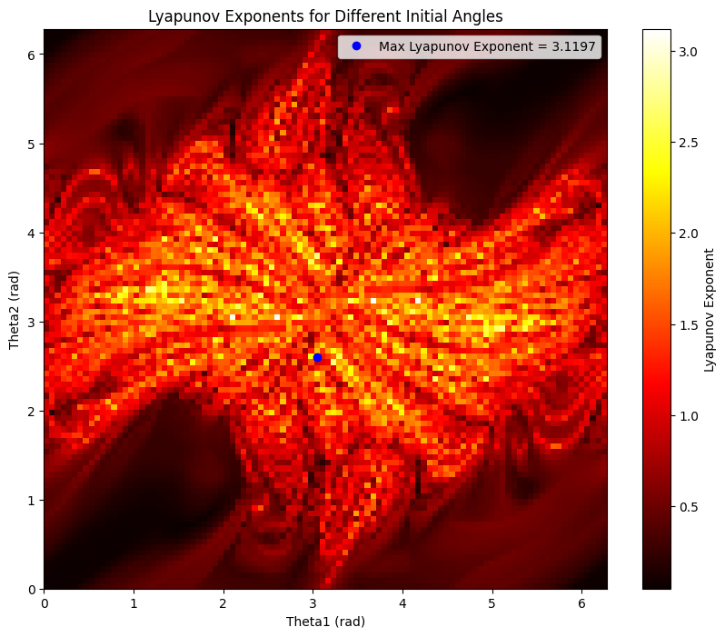

# Maximizing Lyapunov Exponent in a Double Pendulum

### Authors: 
Joonhyun Chang, Justin Le  
May 28th, 2024

## Introduction
This project explores the chaotic motion of a double pendulum by calculating the Lyapunov exponent, which quantifies the system's unpredictability. The goal is to find the optimal initial angles that yield the highest Lyapunov exponent, indicating the most chaotic behavior.

## Example Figure

## Methodology
- **Modeling the Double Pendulum**: Derived equations of motion and simulated them using Euler’s method.
- **Lyapunov Exponent Calculation**: Simulated two states with a small perturbation to measure trajectory divergence and calculate the Lyapunov exponent.
- **Parameter Optimization**: Identified the initial angles that maximize chaos using a heatmap visualization.

## Colab
[Open in Colab](https://colab.research.google.com/drive/1nmv1_T3d5HePZc-PVD-Mgf7Kx-aj5dN5)
